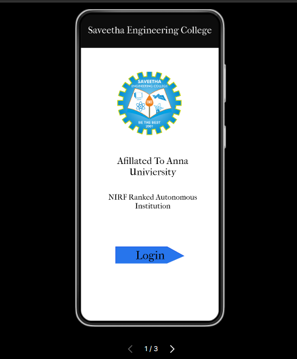
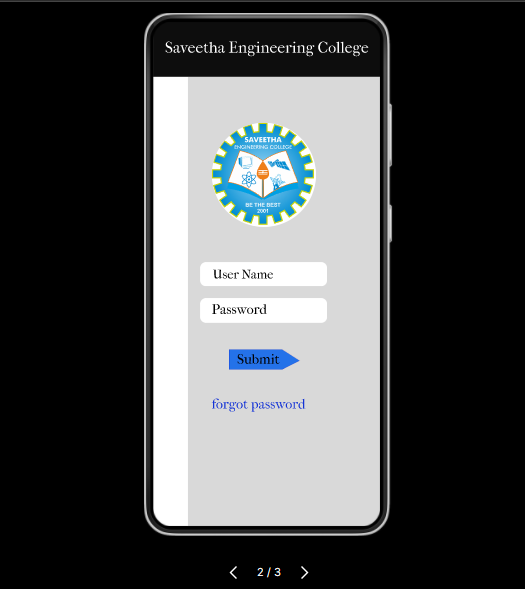
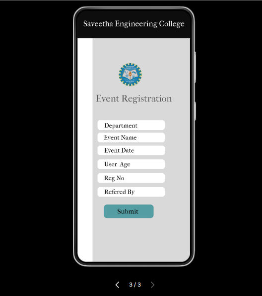

# Event Registration Web Application

## AIM:
To design, develop and deploy a web application for event registration.

## DESIGN STEPS:

### Step 1:
Go to the figma.com website.

### Step 2:
login and create a team project.

### Step 3:
Each team members can take part in designing the pages.

### Step 4:
Create login page, home page, report page, registration page and thank you page.

### Step 5:
Prototype the pages.

### Step 6:

Validate the HTML and CSS code.

### Step 6:

Publish the website in the given URL.

## DESIGN:

## PROGRAM :
```
Name : Manoj S
Reg no : 212222100025
```
```
/* Home */

position: relative;
width: 360px;
height: 800px;

background: #FFFFFF;
/* topbox */

position: absolute;
width: 360px;
height: 88px;
left: 0px;
top: 0px;

background: rgba(0, 0, 0, 0.95);

/* Saveetha Engineering College */

position: absolute;
width: 360px;
height: 34px;
left: calc(50% - 360px/2);
top: 27px;

font-family: 'IM FELL French Canon';
font-style: normal;
font-weight: 400;
font-size: 25px;
line-height: 29px;
text-align: center;

color: #FFFFFF;

/* Afillated To Anna Univiersity */

position: absolute;
width: 299px;
height: 63px;
left: 38px;
top: 368px;

font-family: 'IM FELL French Canon';
font-style: normal;
font-weight: 400;
font-size: 25px;
line-height: 29px;
text-align: center;

color: #000000;

/* NIRF Ranked Autonomous Institution */

position: absolute;
width: 299px;
height: 71px;
left: 38px;
top: 465px;

font-family: 'IM FELL French Canon';
font-style: normal;
font-weight: 400;
font-size: 20px;
line-height: 23px;
text-align: center;

color: #000000;

/* logosaveetha 1 */

position: absolute;
width: 171px;
height: 165px;
left: 95px;
top: 155px;

background: url(logosaveetha.png);

/* loginshapebox */

position: absolute;
width: 180px;
height: 44.25px;
left: calc(50% - 180px/2);
top: calc(50% - 44.25px/2 + 229.12px);

background: rgba(21, 106, 235, 0.92);
border: 1px solid #610E0E;

/* Login */

position: absolute;
width: 181px;
height: 45px;
left: 90px;
top: 606px;

font-family: 'IM FELL French Canon';
font-style: normal;
font-weight: 400;
font-size: 30px;
line-height: 35px;
display: flex;
align-items: center;
text-align: center;

color: #000002;

/* LoginPage */

position: relative;
width: 360px;
height: 800px;

background: #FFFFFF;
/* contentbox */

position: absolute;
width: 305px;
height: 712px;
left: 55px;
top: 88px;

background: #D9D9D9;

/* topbox */

position: absolute;
width: 360px;
height: 88px;
left: 0px;
top: 0px;

background: rgba(0, 0, 0, 0.95);

/* Saveetha Engineering College */

position: absolute;
width: 360px;
height: 34px;
left: calc(50% - 360px/2);
top: 27px;

font-family: 'IM FELL French Canon';
font-style: normal;
font-weight: 400;
font-size: 25px;
line-height: 29px;
text-align: center;

color: #FFFFFF;

/* logosaveetha 1 */

position: absolute;
width: 165px;
height: 165px;
left: 93px;
top: 161px;

background: url(logosaveetha.png);
border-radius: 82.5px;

/* Vector 1 */

position: absolute;
width: 112px;
height: 32px;
left: calc(50% - 112px/2 - 4px);
top: calc(50% - 32px/2 + 136px);

background: rgba(21, 106, 235, 0.92);
border: 1px solid #610E0E;

/* Submit */

position: absolute;
width: 96px;
height: 32px;
left: 119px;
top: 520px;

font-family: 'IM FELL French Canon';
font-style: normal;
font-weight: 400;
font-size: 22px;
line-height: 26px;
display: flex;
align-items: center;
text-align: center;

color: #000002;

/* Registration Page */

position: relative;
width: 360px;
height: 800px;

background: #FFFFFF;
/* contentbox */

position: absolute;
width: 312px;
height: 712px;
left: 48px;
top: 88px;

background: #D9D9D9;

/* logosaveetha 2 */

position: absolute;
width: 73.9px;
height: 75px;
left: 132px;
top: 167px;

background: linear-gradient(0deg, rgba(0, 0, 0, 0.2), rgba(0, 0, 0, 0.2)), url(logosaveetha.png);
border-radius: 82.5px;

/* topbox */

position: absolute;
width: 360px;
height: 88px;
left: 0px;
top: 0px;

background: rgba(0, 0, 0, 0.95);

/* Saveetha Engineering College */

position: absolute;
width: 360px;
height: 34px;
left: calc(50% - 360px/2);
top: 27px;

font-family: 'IM FELL French Canon';
font-style: normal;
font-weight: 400;
font-size: 25px;
line-height: 29px;
text-align: center;

color: #FFFFFF;

/* referalbox */

position: absolute;
width: 215px;
height: 31px;
left: 64px;
top: 562px;

background: #FFFFFF;
border-radius: 9px;

/* Refered By */

position: absolute;
width: 98px;
height: 23px;
left: 85px;
top: 566px;

font-family: 'IM FELL French Canon';
font-style: normal;
font-weight: 400;
font-size: 20px;
line-height: 23px;
display: flex;
align-items: center;
text-align: center;

color: #000000;

/* regnobox */

position: absolute;
width: 215px;
height: 31px;
left: 64px;
top: 518px;

background: #FFFFFF;
border-radius: 9px;

/* agebox */

position: absolute;
width: 215px;
height: 31px;
left: 64px;
top: 476px;

background: #FFFFFF;
border-radius: 9px;

/* User Age */

position: absolute;
width: 84px;
height: 23px;
left: 85px;
top: 478px;

font-family: 'IM FELL French Canon';
font-style: normal;
font-weight: 400;
font-size: 20px;
line-height: 23px;
display: flex;
align-items: center;
text-align: center;

color: #000000;

/* Eventdatebox */

position: absolute;
width: 215px;
height: 31px;
left: 64px;
top: 430px;

background: #FFFFFF;
border-radius: 9px;

/* Eventnamebox */

position: absolute;
width: 215px;
height: 31px;
left: 64px;
top: 389px;

background: #FFFFFF;
border-radius: 9px;

/* Deptbox */

position: absolute;
width: 215px;
height: 31px;
left: 64px;
top: 347px;

background: #FFFFFF;
border-radius: 9px;

/* Department */

position: absolute;
width: 157px;
height: 30px;
left: 59px;
top: 347px;

font-family: 'IM FELL French Canon';
font-style: normal;
font-weight: 400;
font-size: 20px;
line-height: 23px;
display: flex;
align-items: center;
text-align: center;

color: #000000;

/* Event Registration */

position: absolute;
width: 264px;
height: 35px;
left: 48px;
top: 263px;

font-family: 'IM FELL French Canon';
font-style: normal;
font-weight: 400;
font-size: 30px;
line-height: 35px;
display: flex;
align-items: center;
text-align: center;

/* Event Name */

position: absolute;
width: 147px;
height: 21px;
left: 63px;
top: 394px;

font-family: 'IM FELL French Canon';
font-style: normal;
font-weight: 400;
font-size: 20px;
line-height: 23px;
display: flex;
align-items: center;
text-align: center;

color: #000000;

/* Event Date */

position: absolute;
width: 96px;
height: 23px;
left: 85px;
top: 434px;

font-family: 'IM FELL French Canon';
font-style: normal;
font-weight: 400;
font-size: 20px;
line-height: 23px;
display: flex;
align-items: center;
text-align: center;

color: #000000;

/* Reg No */

position: absolute;
width: 84px;
height: 31px;
left: 75px;
top: 518px;

font-family: 'IM FELL French Canon';
font-style: normal;
font-weight: 400;
font-size: 20px;
line-height: 23px;
display: flex;
align-items: center;
text-align: center;

color: #000000;

/* submitbox */

position: absolute;
width: 159px;
height: 43px;
left: 84px;
top: 618px;

background: rgba(48, 141, 147, 0.79);
border-radius: 10px;

/* Submit */

position: absolute;
width: 96px;
height: 32px;
left: 113px;
top: 624px;

font-family: 'IM FELL French Canon';
font-style: normal;
font-weight: 400;
font-size: 22px;
line-height: 26px;
display: flex;
align-items: center;
text-align: center;

color: #000002;

```
## OUTPUT:
### Home Page :

### Login Page :

### Registration Page :


## Result:

Thus, A Web application for event registration is designed and displayed.